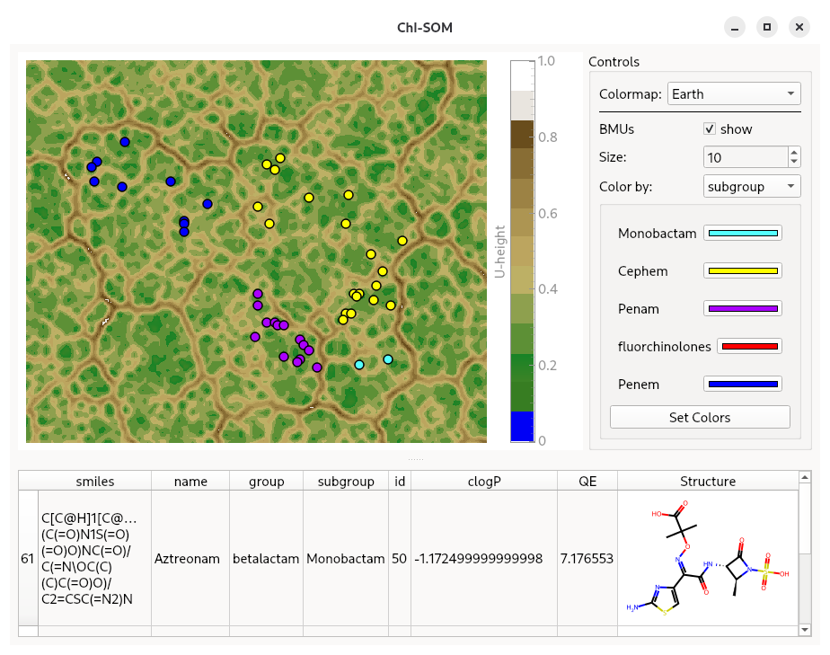

# &#7521;-SOM

> **Ch**em**I**nformatics SOM Toolkit

&#7521;-SOM is a high-performance framework for training emergent self-organizing maps (ESOMs) with a specific focus on cheminformatics; including on-disc, low-latency data storage and a GUI.  
It was specifically developed for visualising the chemical space of million-scale molecular datasets and for interactive exploration.




## Installation
Currently, __ChI-SOM__ is only available for Linux, and Windows using _WSL2_.

It can be installed directly from PyPI
```sh
pip install chi-som
```  
  
For the CUDA compute backend, `numba-cuda` is required.
On systems running CUDA, ChI-SOM can be installed with CUDA support via
```sh
pip install chi-som[cu12]
```
for CUDA13 or 
```sh
pip install chi-som[cu13]
```
for CUDA12  
  
Please refer to the [numba-cuda](https://nvidia.github.io/numba-cuda/) documentation for more complex setups.

## CAVEAT
This software may be considered to be in beta stage. While the user-facing API is expected to remain stable up to a 2.0 release, the internal API might change at any release and can not be considered stable.  

## Usage example

```python
import numpy as np

from chisom import Som, start_chisom_viewer
from chisom.utils import decay_linear, lattice_size

data = np.random.random((600, 400))

# Set up with ESOM rules
n_datapoints, n_features = data.shape
rows, columns = lattice_size(n_datapoints)
SIGMA = rows // 2

# Create a SOM object
# The high and low parameters should be chosen according to the dataset values
som = Som(
    rows,
    columns,
    n_features,
    low=data.min(),
    high=data.max(),
)

N_EPOCHS = 30

# The training loop
for epoch in range(N_EPOCHS):
    # Calculate the current sigma and alpha values using decay functions
    current_sigma = decay_linear(epoch, SIGMA, total_iterations=N_EPOCHS)
    current_alpha = decay_linear(epoch, 0.8, total_iterations=N_EPOCHS)

    # Train one epoch
    som.train(data, epoch, current_sigma, current_alpha)

# Calculate the U-Matrix
umx = som.get_umatrix()

# Predict the best matching units and quantization errors for all data points
bmus, qe = som.predict(data)


# Using the GUI needs information to overlay on the datapoints
dataset = pd.from_dict(
    {"Type:": ["A"] * len(data)}
)

# Start the GUI
start_chisom_viewer(umx, bmus, dataset)
```  

## Development Setup
ChI-SOM is developed, built, and packaged using [Astral uv](https://docs.astral.sh/uv/)

To set up a development environment initalize with
```sh
uv sync
```  

To build run
```sh
uv build
```  


## Meta
Authors: Johannes Kaminski, Oliver Koch @ [AG Koch](https://www.uni-muenster.de/Chemie.pz/forschen/ag/koch/index.html)  
Contact: j.kaminski[at]uni-muenster.de

ChI-SOM is distributed under the LGPLv3. See LICENCES for more information.